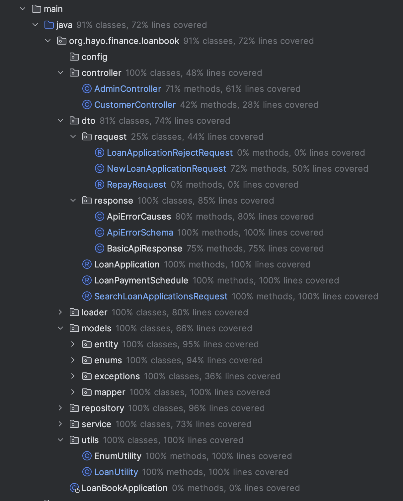

# Loan Book App

A one-stop solution for all your loan needs. This app helps you to manage your loans, track your payments and also helps
you to calculate your EMI.

## Tech Stack

- Backend: Java, Spring Boot, Hibernate
- Database: PostgresSQL

## Assumptions

- PostgresSQL is used as the database which is a SQL database. The nature of the data is structured and hence a SQL
  database is used.
- Repay is done on Loan basis and not on EMI basis. The user can repay the loan amount more than EMI amount.
- Due to limited time and resources, interest calculation is not implemented. The interest calculation can be
  implemented in the future.

### Installation Software required

- Docker
- Java 17
- Maven for build/test/run automation
- IntelliJ Community Edition(Optional)

### Installation Steps

#### Database

1. Install Docker on your machine
2. Clone the repository
3. Run the following [Docker Compose file](compose.yaml) to start the Database

```bash
docker-compose up
```

#### Backend - Java Spring Boot

1. Install `maven` which is a build automation tool used primarily for Java projects.
2. Navigate to the `backend` directory
3. Run the following command to start the backend server
   to compile and regenerate the jar file, run the following command

```bash
mvn clean install
```

the above command will generate a jar file in the target folder, to run the jar file, run the following command

```bash
mvn spring-boot:run -Dspring-boot.run.profiles=local
```

4. Open the browser and navigate to http://localhost:8080/api/swagger-ui.html
5. You can now see the application up and running
6. You can also test the APIs using the Swagger UI/Postman/curl

The project can be run in two modes - `local` and `prod`. The default mode is `prod`. To run the project in `prod` mode,
run the following command

```bash
mvn spring-boot:run
```

The local profile will load some dummy data into the database. The prod profile will not load any data into the
database.
The dummy data is loaded from the [  `loan-applications.json`  ](src/main/resources/data/loan-applications.json) file in
the resources folder.

### Project Files/Folders and Structure


- `src/main/java/com/loan/book` - The main package which contains the main class.
- `src/main/java/com/loan/book/config` - The package which contains the configuration classes.
- `src/main/java/com/loan/book/controller` - The package which contains the controller classes.
- `src/main/java/com/loan/book/dto` - The package which contains the DTO classes.
- `src/main/java/com/loan/book/entity` - The package which contains the Entity classes.
- `src/main/java/com/loan/book/exception` - The package which contains the exception classes.
- `src/main/java/com/loan/book/mapper` - The package which contains the mapper classes.
- `src/main/java/com/loan/book/repository` - The package which contains the repository classes.
- `src/main/java/com/loan/book/service` - The package which contains the service classes.
- `src/main/java/com/loan/book/util` - The package which contains the utility classes.

#### More information
- The project is divided into 3 layers - Controller, Service, and Repository.
- The Controller layer is responsible for handling the incoming requests and sending the response back to the client.
- The Service layer is responsible for the business logic and the interaction with the database.
- The Repository layer is responsible for interacting with the database.
- The project follows the MVC architecture.
- The project uses the Spring Boot framework which is a microservice framework.
- The project uses the Hibernate ORM framework for interacting with the database.
- The project uses the PostgresSQL database which is a SQL database.
- The project uses the Lombok library for reducing boilerplate code.
- The project uses the Swagger UI for API documentation.
- The project uses the Junit and Mockito libraries for testing.
- The project uses the Mapstruct library for mapping the DTOs to Entities and vice versa.

#### API Documentation


#### Testing

